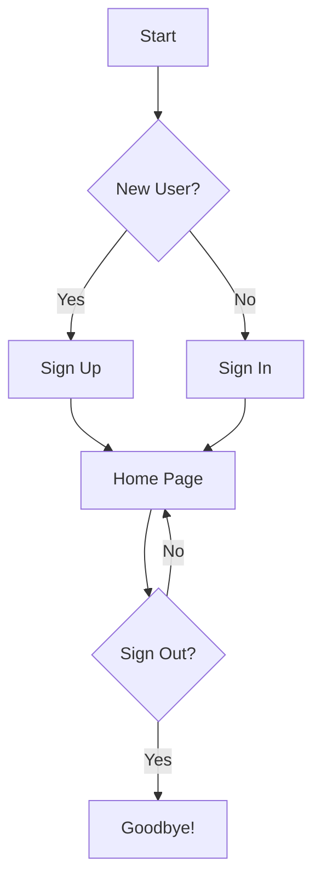
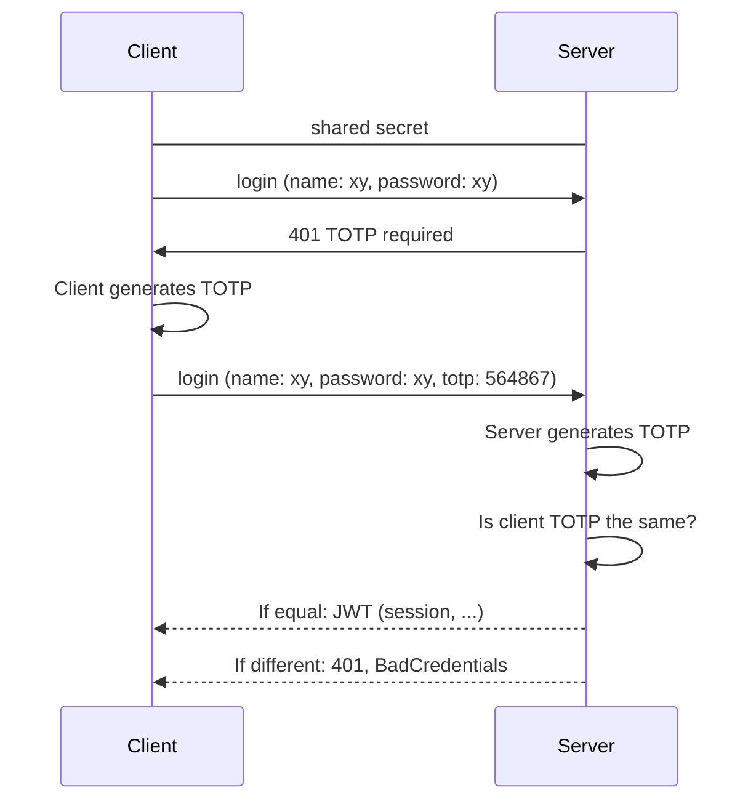
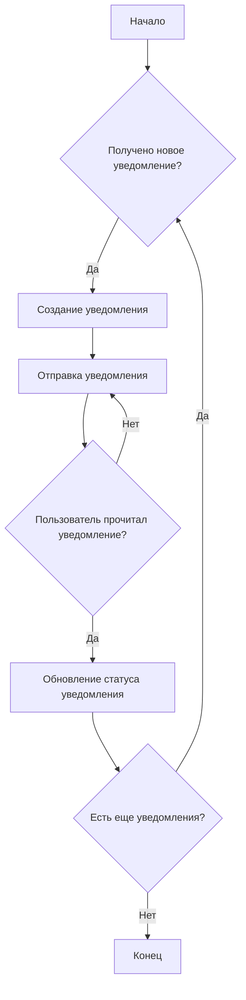

# WolfCalc

## Описание проекта

WolfCalc - это комплексная система, которая включает в себя следующие компоненты:

### Сервер
Сервер обрабатывает запросы от клиентских приложений, обеспечивает передачу решений пользователю и сообщений между пользователями. Он также управляет всеми подсистемами и обеспечивает их взаимодействие.

### База данных
База данных хранит информацию о пользователях, сообщениях, запросах и других данных, необходимых для функционирования приложения. Она обеспечивает быстрый и надежный доступ к данным.

### Клиентское приложение (веб версия)
Клиентское приложение обеспечивает пользовательский интерфейс для взаимодействия с сервером. Оно позволяет пользователям отправлять запросы на вычисления, просматривать результаты и общаться с другими пользователями.

### Подсистема управления пользователями
Подсистема управления пользователями управляет учетными записями пользователей и их правами доступа. Она позволяет создавать, изменять и удалять учетные записи, а также управлять правами доступа пользователей.

### Подсистема передачи сообщений (брокер-сообщений)
Подсистема передачи сообщений обеспечивает обмен сообщениями между пользователями и системой. Она позволяет пользователям общаться в реальном времени и получать уведомления от системы.

### Подсистема вычислений
Подсистема вычислений выполняет все необходимые вычисления, требуемые для обработки запросов пользователей. Она включает в себя различные алгоритмы и методы вычислений.

### Подсистема авторизации и аутентификации

#### Диаграмма входа в систему по умолчанию

#### TOTP (Time-based One-Time Password)
Метод одноразовых паролей, основанный на времени, генерирует одноразовые пароли, используя общий секрет в сочетании с временным окном в качестве источника уникальности. Этот алгоритм используется в широко известных приложениях-аутентификаторах, например Google Authenticator, Mircrosoft Authenticator и других.

#### TOTP диаграмма

### Подсистема управления уведомлениями
Подсистема управления уведомлениями управляет отправкой уведомлений пользователям. Она позволяет системе информировать пользователей о различных событиях, таких как завершение вычислений или получение нового сообщения.

### Подсистема администрирования
Подсистема администрирования позволяет администраторам управлять и настраивать систему. Она предоставляет инструменты для мониторинга состояния системы, управления пользователями и настройки параметров системы.

Каждый из этих компонентов имеет свой собственный README файл, который содержит более подробную информацию о его реализации и использовании.
